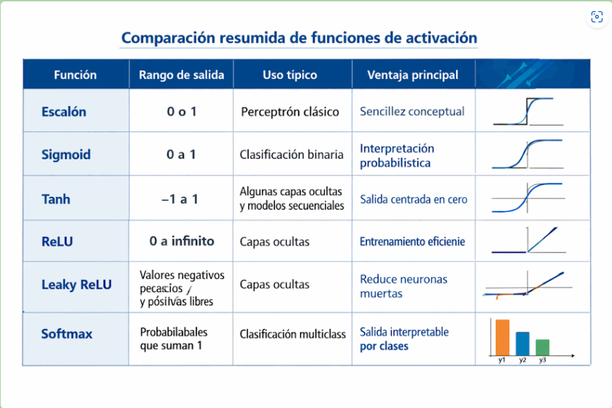

# 6. Funciones de activación

## 6.1 Introducción
Hasta ahora vimos que una neurona artificial toma entradas, las multiplica por pesos, suma un bias y obtiene un valor intermedio. Pero todavía falta una pieza esencial: la función de activación.

Las funciones de activación son fundamentales en Deep Learning porque determinan cómo responde una neurona y, sobre todo, porque permiten que una red neuronal aprenda relaciones complejas. Sin ellas, incluso una red con muchas capas tendría una capacidad muy limitada.

En este tema vamos a estudiar qué son, por qué son necesarias y cuáles son las funciones de activación más utilizadas.

## 6.2 ¿Qué es una función de activación?
Una función de activación es una función matemática que se aplica al resultado de la suma ponderada de una neurona. Ese resultado intermedio suele llamarse $z$.

Es decir, la neurona primero calcula:
$$z = (x_1 \cdot w_1) + (x_2 \cdot w_2) + \dots + b$$

Luego, en lugar de usar directamente ese valor, aplica una función:
$$	ext{salida} = 	ext{activacion}(z)$$

La salida final de la neurona depende entonces no solo de la combinación de entradas, sino también de la forma en que la función de activación transforma ese valor.

## 6.3 ¿Por qué son necesarias?
La razón principal es que **introducen no linealidad**. Esto puede sonar técnico, pero la idea es sencilla: muchos problemas reales no pueden resolverse con relaciones lineales simples.

Si una red neuronal no tuviera funciones de activación, aunque tuviera muchas capas, el resultado total seguiría siendo equivalente a una sola transformación lineal. Eso reduciría enormemente su poder.

Gracias a las activaciones, la red puede aprender patrones complejos, fronteras de decisión curvas, relaciones no proporcionales y estructuras mucho más ricas.

> **Idea clave:** Las funciones de activación permiten que las redes neuronales sean realmente potentes.

## 6.4 Un ejemplo intuitivo
Imaginemos que queremos predecir si una persona aprobará un examen. Si usáramos solo una combinación lineal de variables, la red estaría limitada a decisiones muy simples. Pero en la realidad, el efecto de las variables puede no ser lineal.

Por ejemplo:
* Estudiar 1 hora extra puede ayudar mucho si una persona estudió poco.
* Pero estudiar 1 hora más cuando ya estudió muchísimo puede cambiar menos el resultado.

Las relaciones reales no siempre son rectas. Las activaciones ayudan a modelar esas curvas y comportamientos más complejos.

## 6.5 Del perceptrón a las activaciones modernas
En el perceptrón clásico, la función de activación era una función escalón. Si el valor superaba cierto umbral, la neurona devolvía 1; si no, devolvía 0.

Ese enfoque era útil para decisiones binarias, pero tenía limitaciones. En particular, la función escalón no es adecuada para el entrenamiento con gradientes porque no es suave ni derivable de una manera útil para los algoritmos modernos.

Por eso, las redes neuronales actuales utilizan otras funciones de activación más apropiadas para entrenar modelos profundos.

## 6.6 Características deseables de una función de activación
No cualquier función matemática sirve igual de bien. En Deep Learning suelen valorarse características como estas:
* Que introduzca no linealidad.
* Que sea eficiente de calcular.
* Que permita entrenar la red con gradientes.
* Que no bloquee demasiado el flujo de aprendizaje.
* Que funcione bien en la práctica en distintos tipos de tareas.

Con el tiempo, la comunidad fue probando distintas funciones y observando cuáles funcionaban mejor en diferentes contextos.

## 6.7 Función escalón
La función escalón fue una de las primeras funciones de activación utilizadas. Su lógica es muy simple:
* Si el valor de entrada es mayor o igual que cierto umbral, devuelve 1.
* Si no, devuelve 0.

Es fácil de entender y refleja bien la idea inicial de una neurona que "se activa" o "no se activa".

Sin embargo, tiene un problema importante: no es útil para entrenar redes profundas mediante métodos basados en gradientes. Por eso hoy se estudia más por su valor histórico que por su uso práctico.

## 6.8 Función Sigmoid
La función Sigmoid fue durante mucho tiempo una de las más utilizadas. Toma cualquier número real y lo transforma en un valor entre 0 y 1.

Eso la hace especialmente útil cuando queremos interpretar la salida como una probabilidad. Su forma es suave y curva, y puede entenderse intuitivamente así:
* Valores muy negativos se acercan a 0.
* Valores muy positivos se acercan a 1.
* Valores cercanos a 0 producen salidas intermedias.

Esto la vuelve natural en tareas de clasificación binaria.

## 6.9 Ventajas y desventajas de Sigmoid
* **Ventajas:**
  * Su salida está entre 0 y 1.
  * Es fácil interpretarla como probabilidad.
  * Es suave y continua.
* **Desventajas:**
  * Puede saturarse cuando los valores son muy altos o muy bajos.
  * Eso puede dificultar el aprendizaje porque los gradientes se vuelven muy pequeños (*Vanishing Gradient*).
  * No está centrada en cero, lo que a veces complica la optimización.

Por estas razones, aunque sigue usándose en ciertos casos, ya no suele ser la mejor opción para capas ocultas profundas.

## 6.10 Función Tanh
La función Tanh, o tangente hiperbólica, es parecida a la Sigmoid, pero en lugar de producir valores entre 0 y 1, produce valores entre -1 y 1.

Esto la hace más centrada en cero, lo cual puede ayudar en algunos procesos de entrenamiento. Su comportamiento intuitivo es:
* Valores negativos grandes se acercan a -1.
* Valores positivos grandes se acercan a 1.
* Valores intermedios producen salidas intermedias.

Durante un tiempo fue bastante utilizada en capas ocultas, especialmente antes del dominio de ReLU.

## 6.11 Ventajas y desventajas de Tanh
* **Ventajas:**
  * Está centrada en cero.
  * Puede representar activaciones negativas y positivas.
  * Es más conveniente que Sigmoid en algunos contextos.
* **Desventajas:**
  * También puede saturarse.
  * Puede sufrir el problema del gradiente pequeño en redes profundas.

Por eso, aunque es útil y sigue apareciendo en algunos modelos, muchas arquitecturas modernas prefieren otras opciones.

## 6.12 ReLU: la activación más popular
La función ReLU significa *Rectified Linear Unit*. Es una de las funciones de activación más usadas en Deep Learning moderno.

Su regla es muy simple:
* Si la entrada es positiva, la salida es ese mismo valor.
* Si la entrada es negativa, la salida es 0.

$$	ext{ReLU}(z) = \max(0, z)$$

Esta simplicidad es una de sus grandes ventajas. Es fácil de calcular y, en la práctica, funciona muy bien en muchas redes profundas.

## 6.13 ¿Por qué ReLU tuvo tanto éxito?
ReLU se volvió muy popular por varias razones:
* Es computacionalmente barata.
* Ayuda a evitar parte del problema del gradiente pequeño.
* Suele acelerar el entrenamiento.
* Funciona bien en muchas arquitecturas de visión y aprendizaje profundo.

Gracias a estas ventajas, ReLU pasó a ser la activación por defecto en muchas capas ocultas.

## 6.14 Limitaciones de ReLU
Aunque es muy útil, ReLU no es perfecta. Su principal problema es el llamado fenómeno de las **neuronas muertas** (*Dying ReLU*).

Si una neurona recibe valores negativos de manera persistente, su salida puede quedar siempre en 0, y esa neurona puede dejar de aprender eficazmente. Este problema motivó el desarrollo de variantes que intentan mantener las ventajas de ReLU pero reducir este riesgo.

## 6.15 Leaky ReLU
La función Leaky ReLU es una variante de ReLU. La diferencia es que, cuando la entrada es negativa, en lugar de devolver exactamente 0, devuelve un pequeño valor negativo proporcional (por ejemplo, multiplicado por 0.01).

Esto evita que la neurona quede completamente apagada en la zona negativa. En términos intuitivos:
* Para valores positivos, se comporta parecido a ReLU.
* Para valores negativos, deja pasar una señal pequeña.

Esta variante puede mejorar el entrenamiento en algunos casos.

## 6.16 Otras variantes: PReLU y ELU
Con el tiempo aparecieron otras variantes similares:
* **PReLU (Parametric ReLU):** permite que la pendiente en la parte negativa sea aprendida por el modelo durante el entrenamiento.
* **ELU (Exponential Linear Unit):** suaviza el comportamiento en la zona negativa mediante una curva exponencial y puede ayudar en ciertos escenarios.

No necesitas memorizar todas estas variantes ahora. Lo importante es entender que surgieron como intentos de mejorar o adaptar el comportamiento de ReLU.

## 6.17 Softmax
La función Softmax se usa principalmente en problemas de clasificación multiclase. Cuando hay varias clases posibles, Softmax transforma un conjunto de valores en probabilidades que suman 1.

Por ejemplo, si una red debe decidir si una imagen es un perro, un gato o un caballo, la capa final puede producir tres valores. Softmax convierte esos valores en probabilidades interpretables. Esto permite que la clase con mayor probabilidad se tome como la predicción final.

## 6.18 Diferencia entre usar Sigmoid y Softmax
Es común preguntarse cuándo se usa Sigmoid y cuándo Softmax:
* **Sigmoid:** suele usarse en clasificación binaria, donde hay dos posibilidades principales (Spam / No Spam).
* **Softmax:** suele usarse en clasificación multiclase exclusiva, donde una muestra pertenece a una sola clase entre varias (Perro, Gato o Caballo).

Esta diferencia es muy importante al diseñar la capa de salida de una red.

## 6.19 Activaciones en capas ocultas y en la capa de salida
No siempre se usa la misma función de activación en toda la red. De hecho, una práctica habitual es:
1. Usar **ReLU o variantes** en las capas ocultas.
2. Usar **Sigmoid o Softmax** en la capa de salida, según el problema.

La elección depende del tipo de tarea que queremos resolver.

## 6.20 ¿Qué pasa si no usamos activación?
Si no usamos función de activación en las capas ocultas, la red pierde gran parte de su potencia. Aunque haya muchas capas, el resultado total puede colapsar en algo equivalente a una sola transformación lineal.

Eso significa que la red no aprovecharía la profundidad para aprender relaciones complejas. En otras palabras, tendríamos un modelo mucho más pobre. Por eso las activaciones no son un detalle opcional: son una pieza central del Deep Learning.

## 6.21 Relación con el problema del gradiente
Más adelante estudiaremos con detalle la propagación hacia atrás y el descenso del gradiente. Por ahora basta con entender que algunas funciones de activación facilitan más el aprendizaje que otras.

Funciones como Sigmoid y Tanh pueden sufrir saturación, lo que hace que los gradientes se vuelvan muy pequeños en ciertas zonas. Eso dificulta el entrenamiento de redes profundas. ReLU y sus variantes ayudaron a mitigar parte de este problema y por eso fueron tan importantes en el avance del Deep Learning moderno.

## 6.22 Ejemplo intuitivo de activación en una neurona
Imaginemos una neurona que analiza si una foto tiene rasgos de un gato. Después de combinar varias señales internas, obtiene un valor $z$.

La función de activación decide cómo interpretar ese valor:
* Con una **función escalón**, decidiría casi de manera rígida: sí o no.
* Con **Sigmoid**, podría devolver una probabilidad entre 0 y 1 (ej. 0.85 de probabilidad de ser gato).
* Con **ReLU**, podría dejar pasar solo activaciones positivas relevantes, descartando el ruido negativo.

La elección de la función cambia la forma en que la red procesa y transmite información.

## 6.23 Comparación resumida de funciones de activación

## 6.24 ¿Cuál es la mejor función de activación?
No existe una función de activación universalmente mejor para todos los casos. La elección depende del tipo de capa, de la tarea y del comportamiento deseado.

Como orientación general:
* En **capas ocultas**, ReLU suele ser una opción muy buena para empezar.
* En **clasificación binaria**, Sigmoid es habitual en la salida.
* En **clasificación multiclase**, Softmax suele ser la opción natural en la salida.

En la práctica, muchas decisiones se toman combinando teoría, experiencia y experimentación.

## 6.25 Relación con PyTorch
En PyTorch, las funciones de activación se usan constantemente al construir modelos. Algunas pueden aplicarse como funciones (módulo `torch.nn.functional`) y otras aparecen como capas específicas (`nn.ReLU`, `nn.Sigmoid`, etc.) dentro de la red.

Durante el curso veremos cómo integrar activaciones dentro de modelos reales y cómo elegirlas según el problema. Lo importante por ahora es comprender que una red sin activaciones bien elegidas difícilmente pueda aprender de manera efectiva.

## 6.26 Qué debes recordar de este tema
* Una función de activación transforma la salida intermedia de una neurona.
* Su papel principal es introducir no linealidad.
* Sin activaciones, una red profunda pierde gran parte de su capacidad expresiva.
* La función escalón fue importante históricamente, pero hoy tiene uso limitado.
* Sigmoid es útil en clasificación binaria.
* Tanh produce valores entre -1 y 1 y está centrada en cero.
* ReLU es una de las activaciones más usadas en capas ocultas.
* Softmax es muy útil en clasificación multiclase.

## 6.27 Conclusión
Las funciones de activación son una de las piezas más importantes del Deep Learning. Gracias a ellas, una red neuronal puede superar la linealidad y aprender patrones complejos en los datos.

Entender este tema es esencial porque conecta la estructura de la neurona con el verdadero poder de la red. A partir de aquí, ya estamos listos para estudiar cómo se organiza una red completa y cómo estas neuronas activadas se combinan para formar arquitecturas más grandes.